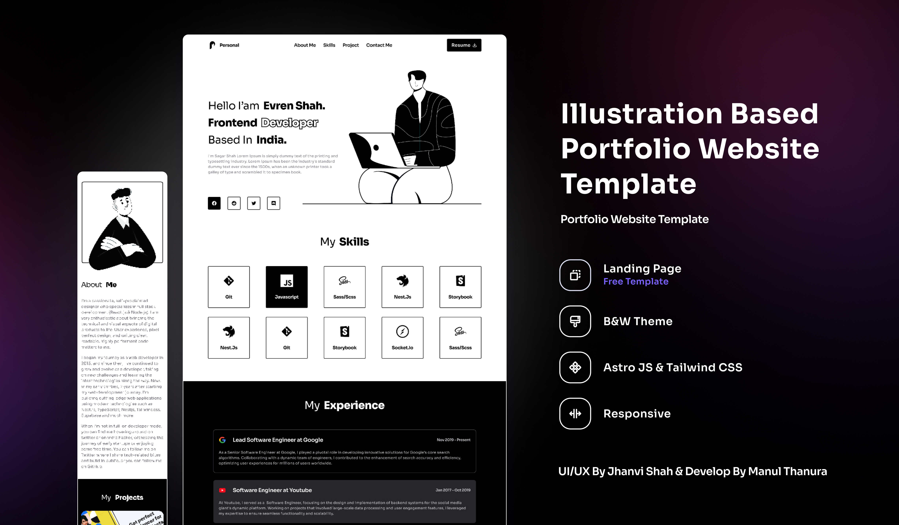

# Illustration Based Portfolio Website Template

A portfolio template built with astro and tailwindcss for illustrators and designers.

 



## 🚀 Project Structure

Inside of your Astro project, you'll see the following folders and files:

```text
/
├── public/
│   └── assets...
├── src/
│   ├── components/
│   │   ├── Nav.astro
│   │   ├── Hero.astro
│   │   ├── About.astro
│   │   ├── Skills.astro
│   │   ├── Projects.astro
│   │   ├── Contact.astro
|   │   └── Footer.astro
│   ├── layouts/
│   │   └── Layout.astro
│   ├──  pages/
│   │   └── index.astro
│   └── styles/
│       └── global.css
└── package.json
```

Astro looks for `.astro` or `.md` files in the `src/pages/` directory. Each page is exposed as a route based on its file name.

There's nothing special about `src/components/`, but that's where we like to put any Astro/React/Vue/Svelte/Preact components.

Any static assets, like images, can be placed in the `public/` directory.

## 🧞 Commands

All commands are run from the root of the project, from a terminal:

| Command                   | Action                                           |
| :------------------------ | :----------------------------------------------- |
| `npm install`             | Installs dependencies                            |
| `npm run dev`             | Starts local dev server at `localhost:4321`      |
| `npm run build`           | Build your production site to `./dist/`          |
| `npm run preview`         | Preview your build locally, before deploying     |
| `npm run astro ...`       | Run CLI commands like `astro add`, `astro check` |
| `npm run astro -- --help` | Get help using the Astro CLI                     |

## 👀 Want to learn more?

Feel free to check [Astro documentation](https://docs.astro.build) or jump into our [Discord server](https://astro.build/chat).

## 📄 License

This project is licensed under the MIT License - see the [LICENSE.md](LICENSE.md) file for details

## 🙏 Acknowledgments

- [Astro](https://astro.build)
- [Tailwindcss](https://tailwindcss.com)


Ui/Ux Design by [Jhanvi Shah](https://www.figma.com/@jhanvishah) and Developed by [Manul Thanura](https://github.com/manulthanura)